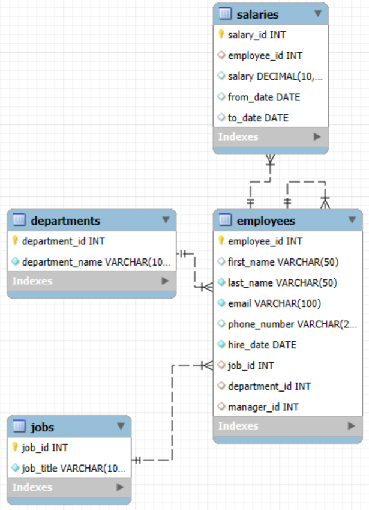

# Employee Management System (MySQL)

A relational database built in MySQL 8.0 using MySQL Workbench 8.0.41 CE to simulate basic employee management operations. Includes tables for employees, departments, jobs, and salaries. Demonstrates use of SQL joins, views, and stored procedures.

## Tools Used

- MySQL Server 8.0
- MySQL Workbench 8.0.41 CE (64-bit)
- SQL (DDL, DML, procedures, views)

## Schema Overview

Tables:
- `departments`: Department names
- `jobs`: Job titles
- `employees`: Employee info and reporting lines
- `salaries`: Salary history

## Features

- Create and manage employee records, jobs, and departments
- Track salaries with from/to dates
- Add employees with a stored procedure
- Generate department-level salary reports
- Summarize data with views

## SQL Files

- [`create_tables.sql`](./create_tables.sql): Table definitions
- [`insert_data.sql`](./insert_data.sql): Sample records
- [`procedures.sql`](./procedures.sql): Stored procedure to add employees
- [`views.sql`](./views.sql): View to summarize employee data

## Sample Queries

### List employees and departments
```sql
SELECT e.first_name, e.last_name, d.department_name
FROM employees e
JOIN departments d ON e.department_id = d.department_id;
```

### Average salary by department
```sql
SELECT d.department_name, AVG(s.salary) AS average_salary
FROM employees e
JOIN departments d ON e.department_id = d.department_id
JOIN salaries s ON e.employee_id = s.employee_id
GROUP BY d.department_name;
```

### Add an employee
```sql
CALL AddEmployee('Eve', 'Martinez', 'eve.m@example.com', '555-0104', '2023-05-01', 1, 1, 1);
```

### View
```sql
SELECT * FROM employee_summary;
```

## How to Use

1. Clone or download this repo  

2. Open MySQL Workbench and connect to your MySQL 8.0 server  

3. Run scripts in this order:  
   • `create_tables.sql`  
   • `insert_data.sql`  
   • `procedures.sql`  
   • `views.sql`  

4. Run queries or extend as needed



## Tableau Dashboard

- 📊 [`total_salary.twbx`](./total_salary.twbx): Bar chart showing total salary by department built in Tableau

## Contact

**Michael B. Mitchell**  
📧 mbmitchell410@gmail.com  
🔗 [LinkedIn](https://www.linkedin.com/in/michaelm410/)
